# Mathematics for Autonomous Systems

Mathematics forms the foundation of all modern robotics and autonomous systems.
Whether designing control algorithms, training neural networks, estimating
states or planning motion, mathematical reasoning provides the language and
tools to model, predict, and optimize the behavior of complex systems.

This section introduces the key mathematical subjects that arise in robotics.
Combined these subjects provide a rigorous formulation and solution to common
problems in perception, motion planning, control and decision making.

```mermaid
%% TITLE: FIGURE 1: Simplified Robotics Domain Map
graph LR
%% Define Node Styles
classDef subject fill:#000000,stroke:#333,stroke-width:2px,rx:5,ry:5,color:#fff;
classDef hub fill:#212121,stroke:#000,stroke-width:3px,rx:10,ry:10,font-weight:bold;

%% 1. The Math Basics
subgraph Foundations
    DS[Dynamical Systems]:::subject
    LS[Linear Systems]:::subject
    PROB[Probability]:::subject
    NUM[Numerical Methods]:::subject
end

%% 2. The Advanced Toolset
subgraph Advanced Topics
    OPT[Optimization]:::subject
    LIE[Lie Theory]:::subject
    ML[Machine Learning]:::subject
end

%% 3. The Robotic Capabilities
subgraph Applications
    EST(Estimation):::hub
    PLAN(Planning):::hub
    PERC(Perception):::hub
    DEC(Decision Making):::hub
end

```

## 0. Dynamical Systems

> Linear and nonlinear ordinary differential equations; initial value problems and
> numerical integration; phase portraits and equilibrium points; Laplace and
> Z-transforms; transfer functions; poles, zeros, and stability analysis;
> state-space representation and linearization.

Nearly every physical interaction in robotics is governed by a dynamical system. You cannot simulate physics, tune a PID controller, design an observer, or guarantee safety without it.

* **Inverted Pendulum Simulation**: Derive the equations of motion using Lagrangian
  mechanics and simulate the nonlinear system. Linearize around the upright
  equilibrium to analyze stability.
* **Pole Placement Algorithm**: Implement a controller designed using the pole
  placement algorithm.
* **Frequency Response Analysis**: Tune a generic 2nd order transfer function to fit
a bode plot of an "unknown" system.

## 1. Linear Systems

> Vector spaces and norms; matrices and linear transformations; rank,
> nullity, and the four fundamental subspaces; eigenvalues and eigenvectors;
> diagonalization and Jordan normal form; orthogonality and projections;
> least-squares fitting; determinants and inverses; QR, SVD, and LU
> decompositions; condition numbers and numerical stability.

Nearly every algorithm in robotics reduces to a linear algebra operation. You
cannot design a Kalman filter, invert kinematics, optimize trajectories, or
compress data without it.

* **Camera Calibration**: Recover intrinsic and extrinsic parameters from
    checkerboard images via least-squares regression.
* **Dynamic Mode Decomposition**: Recover the discrete linear dynamics of a
    system by exciting it and measuring the states.
* **Hardware Optimized BLAS**: Implement a custom matrix multiplication
    function that utilizes a SIMD or NEON hardware features. Use this function
    to simulate and analyze a system. Examine the precision and performance
    between a naive gemm function and a parallelized one.

## 2. Probability and Information Theory

> Probability axioms and rules; conditional probability and Bayes' rule; random
> variables and distributions (Gaussian, exponential, Laplace); expectation,
> variance, and covariance; independence and conditional independence; entropy
> and mutual information; relative entropy (KL divergence); Fisher information
> and the Cramér-Rao bound; parameter estimation (maximum likelihood, MAP);
> Bayes filters and recursive estimation; Kalman filters and Extended Kalman
> Filters; particle filters and Monte Carlo localization.

You cannot fuse sensor data, estimate hidden states, or make principled
decisions under uncertainty without probability theory. It is essential for
perception, localization, and planning in the real world.

* **Particle Filter Localization**: Implement Monte Carlo localization on a
    mobile robot in a known map with laser rangefinder and odometry.
* **Kalman Filter for Inertial Measurement**: Fuse accelerometer and gyroscope
    data to estimate 3D orientation with explicit covariance propagation.
* **Information-Theoretic Path Planning**: Plan a robot's path to maximize
    information gain (reduction in pose uncertainty) measured by Fisher
    information.
* **Sensor Quality Estimation**: Decide when a sensor is producing garbage
    data and should be ignored.

## 3. Numerical Methods

> Root-finding (bisection, Newton-Raphson, secant method); linear system solvers
> (Gaussian elimination, iterative methods); eigenvalue computation
> (power iteration, QR algorithm); numerical integration of ODEs
> (Euler, RK2, RK4, symplectic integrators); error analysis and convergence rates;
> stability of difference equations; stiffness and implicit methods; constraint
> handling (penalty methods, Lagrange multipliers); numerical optimization (line
> search, trust regions, Hessian approximation).

Better controls generally require more compute. Without numerical methods the algorithms realtime controllers can use is limited.

* **Rigid Body Dynamics Simulator**: Integrate rigid-body dynamics (nonlinear
    ODEs) forward in time to predict motion, using RK4 or symplectic integrators
    for energy stability.
* **Inverse Kinematic Control**: Iteratively solve a nonlinear system
    (Newton-Raphson) to find joint angles that achieve a desired end-effector
    pose.

## 4. Lie Theory

> Lie groups and Lie algebras; SO(3) and SE(3); exponential and logarithmic maps;
> tangent spaces and differential; geodesics and geodesic distance; quaternions
> and their relationship to SO(3); adjoint representations; perturbation analysis;
> manifold optimization; numerical integration on manifolds.

Ad-hoc use of Euler angles will lead to singularities and numerical instability.
Proper use of Lie groups ensures your rotation computations are
singularity-free, differentiable, and efficient.

* **Spherical Linear Interpolation (SLERP)**: Interpolate between two 3D
    rotations via the geodesic in SO(3), preserving angular velocity.
* **Kinematic Control on SO(3)**: Implement an attitude feedback controller
    (3-loop autopilot, PID, LQR) to stabilize a quadcopter's attitude.
* **Manifold Sampling for Motion Planning**: Generate collision-free
    configurations sampling directly on SE(3), avoiding singularities.

## 5. Optimization

> Unconstrained optimization (gradient descent, Newton's method, quasi-Newton
> methods, line search, trust regions); convex optimization (convex sets and
> functions, duality, KKT conditions); constrained optimization (Lagrange
> multipliers, penalty and augmented Lagrangian methods); linear programming;
> quadratic programming; semidefinite programming; sequential convex programming;
> gradient-free methods (genetic algorithms, simulated annealing); convergence
> analysis and rates.

You'll spend most of your time formulating problems and choosing solvers.
Understanding convexity, duality, and KKT conditions helps you recognize
solvable problems and detect non-convexity before wasting compute on bad local
minima.

* **Trajectory Optimization**: Design a transfer orbit for a satellite to
    change its orbit altitude. Assume an ideal elliptical orbit at both
    altitudes, the input is the current orbit, target orbit and the output is
    the transfer path (plus entry/exit points).
* **Physics Informed Neural Network**: Use a neural network to solve partial
    differential equations by embedding the physics equations as a
    regularization term in the loss function.

## 6. Machine Learning

> Linear and polynomial regression; regularization (L1, L2); classification
> (logistic regression, SVMs, decision trees); neural networks and
> backpropagation; convolutional and recurrent architectures; unsupervised
> learning (k-means, GMM, PCA); dimensionality reduction (t-SNE, auto-encoders);
> clustering; Bayesian inference and expectation-maximization; reinforcement
> learning (Markov decision processes, value iteration, policy gradient); model
> evaluation and validation.

Modern perception (object detection, pose estimation, semantic segmentation)
relies entirely on learned models. Data-driven control and planning are
increasingly competitive with classical methods.

* **Object Detection and 6D Pose**: Fine-tune a CNN for detecting objects and
    regressing their 3D pose from RGB-D images for robotic grasping.
* **Dynamics Model Learning**: Learn a forward model (state + action → next
    state) from robot trajectories to enable black box model-based planning and
    control.
* **Reinforcement Learning for Navigation**: Train a policy via deep
    Q-learning or policy gradients to navigate a mobile robot to a goal while
    avoiding obstacles.

---
